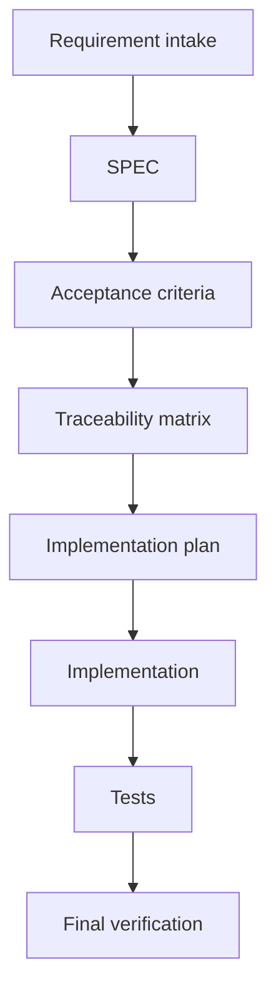

# Dependency Graph

```mermaid
graph TD
  A["Requirement intake"] --> B["SPEC"]
  B --> C["Acceptance criteria"]
  C --> D["Traceability matrix"]
  D --> E["Implementation plan"]
  E --> F["Implementation"]
  F --> G["Tests"]
  G --> H["Final verification"]
```

## Implementation Order

1. Requirement intake.
2. SPEC.
3. Acceptance criteria.
4. Traceability.
5. Implementation.
6. Tests.
7. Final verification.

