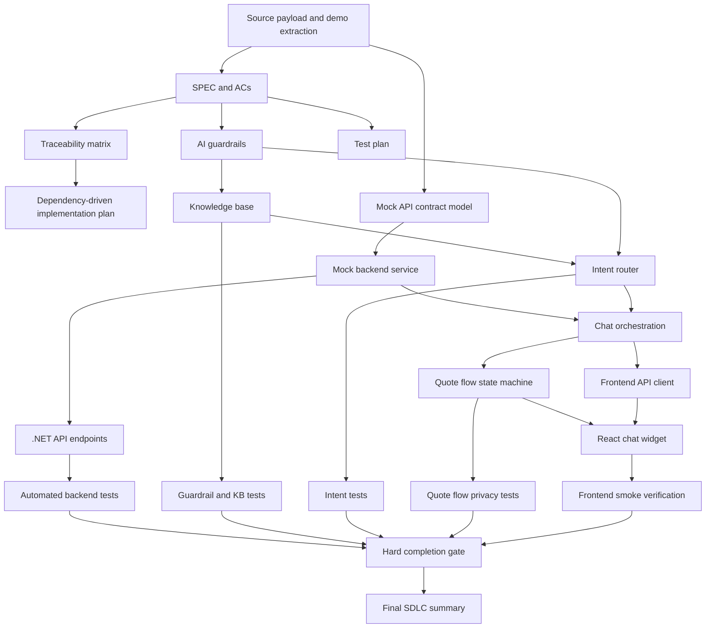

# Dependency Graph

## Implementation Order Derived From Graph

1. Source payload and demo extraction.
2. SPEC and acceptance criteria.
3. Traceability matrix, guardrails, test plan, dependency graph.
4. Mock API contract and local domain models.
5. Knowledge base.
6. Intent router.
7. Mock backend service.
8. Quote flow state machine.
9. Chat orchestration.
10. .NET API endpoints.
11. Frontend API client and React chat widget.
12. Automated tests.
13. Frontend smoke/manual verification.
14. Traceability matrix update.
15. Final SDLC summary.

