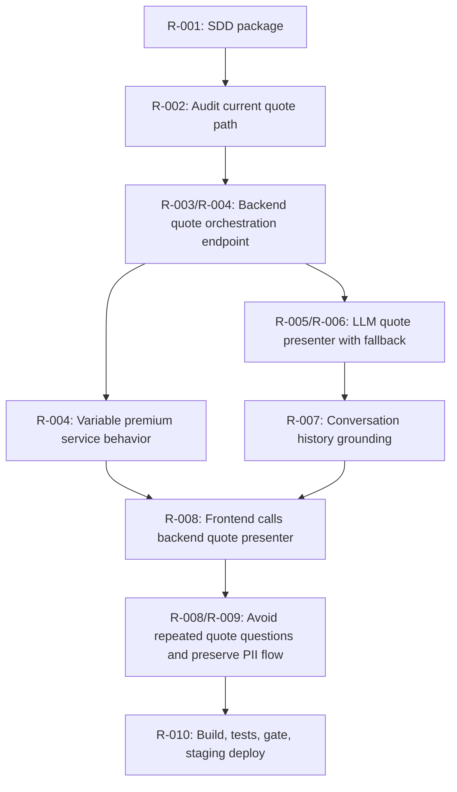

# Dependency Graph

## Implementation Order

1. Author and pass scoped SPEC gate.
2. Add audit evidence to docs.
3. Add backend quote presentation DTOs and service.
4. Add variable backend premium calculation from quote inputs.
5. Add LLM-backed quote presenter with deterministic fallback.
6. Update API endpoint wiring.
7. Update frontend to send conversation history and consume backend quote presentation.
8. Add tests for each AC.
9. Build, test, final gate, and deploy to staging slot only.
