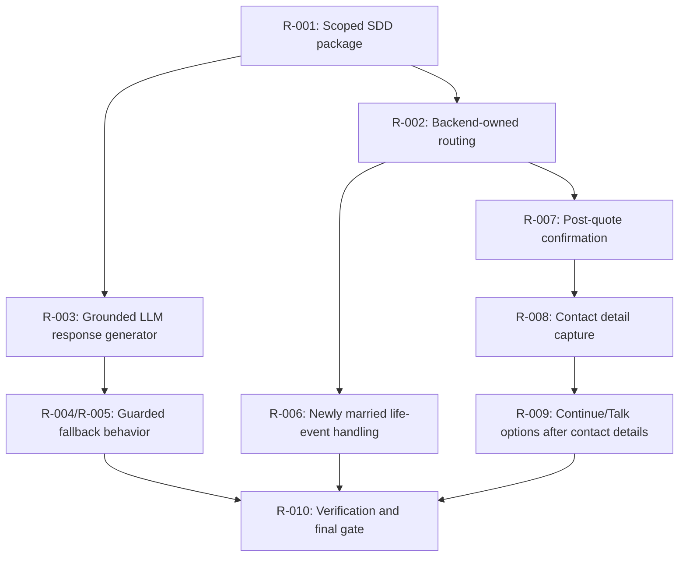

# Dependency Graph

## Implementation Order

1. Author and gate the scoped SDD documents.
2. Add grounded LLM response generation interfaces and fallback behavior.
3. Wire response generation into `ChatOrchestrator`.
4. Move frontend free-text routing to backend response intent handling.
5. Add post-quote confirmation and contact-detail capture state.
6. Add tests for LLM grounding, frontend routing, life-event behavior, and PII sequencing.
7. Run build, test suite, traceability update, and final gate.
