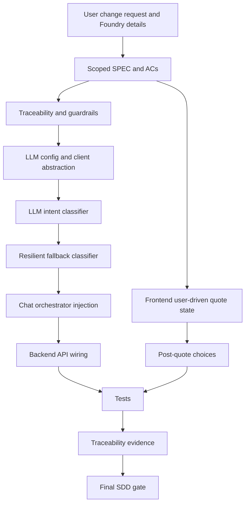

# Dependency Graph

## Implementation Order

1. Scoped SDD docs.
2. LLM config/client abstraction.
3. LLM intent classifier.
4. Resilient fallback classifier.
5. Backend DI/API wiring.
6. Frontend user-driven quote state.
7. Post-quote continue/talk-to-agent choices.
8. Verification tests.
9. Traceability and final summary.
10. Final SDD gate.

