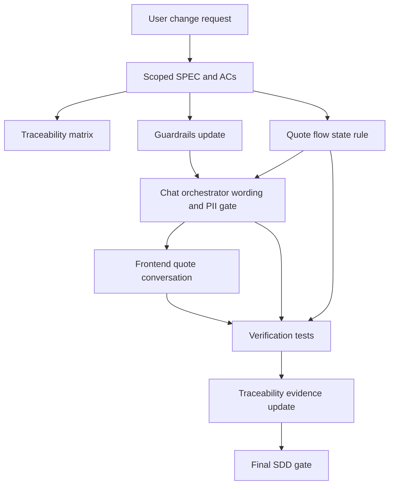

# Dependency Graph

## Implementation Order

1. Author scoped SDD docs.
2. Run scoped SPEC gate.
3. Update quote flow state.
4. Update chat orchestrator and knowledge base wording.
5. Update frontend guided conversation and customer-facing copy.
6. Update tests for four-field quote readiness, post-quote PII, and production-ready wording.
7. Run build and full verification tests.
8. Update traceability and final summary.
9. Run final scoped SDD gate.

